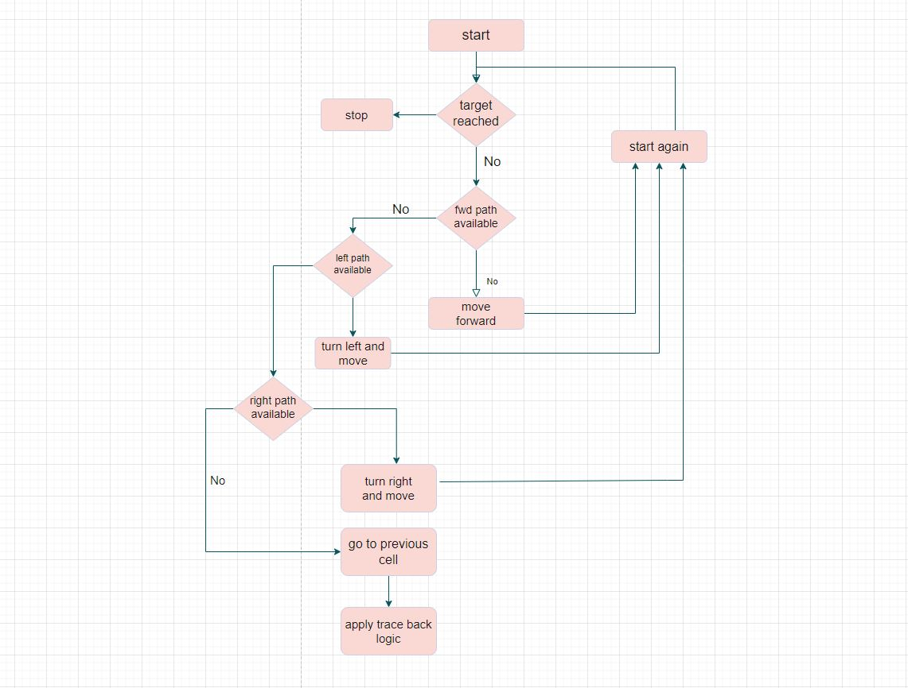

# Portfolio Project: 3D-Maze

## Introduction

**Purpose:** The Maze Solver project aimed to develop an interactive maze-solving application using SDL2, offering a combination of entertainment and algorithmic challenges.

**Team Members:** David

**Roles and Timeline:**
**David:**
              - Lead Developer
              - UI/UX Design
              - Algorithm Specialist

**Target Audience:** Maze enthusiasts, puzzle solvers, and those interested in game development.

**Personal Focus:** My primary focus was on implementing the raycasting algorithm for realistic rendering and enhancing the user interface.

## My Story

Choosing the Maze Solver project wasn't just about enjoying mazes. I have a deep-rooted fascination with spatial problem-solving. Growing up in a small town, I spent hours navigating cornfield mazes. Those experiences inspired me to create an application that captures the joy of maze-solving and brings it to a broader audience, especially in a city setting.

## Project Accomplishments

**Result:** The Maze Solver application is a fully functional maze exploration tool with realistic raycasting graphics.

**Architecture:**

**Technologies Used:**
- C Programming Language
- SDL2 Library for graphics
- Raycasting algorithm for realistic rendering

**Features:**
1. **Realistic Raycasting:** Implemented a raycasting algorithm for lifelike graphics.
2. **Interactive Maze Exploration:** Users can navigate through mazes using keyboard controls.
3. **Dynamic Map Generation:** Randomly generated mazes for endless exploration.

## Most Difficult Technical Challenge

**Situation:** Implementing the raycasting algorithm proved to be the most challenging task.

**Task:** Achieve realistic 3D graphics and accurate rendering of walls.

**Action:** Engaged in extensive research on raycasting algorithms, sought guidance from peers, and iteratively refined the implementation.

**Result:** Successfully implemented raycasting, achieving the desired lifelike graphics within the project timeline.

## Lessons Learned

- **Technical Takeaways:** Mastering the raycasting algorithm enhanced my understanding of computer graphics and game development.
- **What I Would Do Differently:** I'd allocate more time for testing and optimization to enhance the application's performance.
- **About Myself as an Engineer:** I discovered my resilience and problem-solving skills in overcoming complex technical challenges.
- **Future Engineering Path:** This project fueled my passion for graphics programming, and I plan to explore more advanced rendering techniques in future projects.

## Conclusion

The Maze Solver project was an incredible journey, blending childhood memories with a technical challenge. As I continue my engineering path, the lessons learned and accomplishments achieved during this project will undoubtedly shape my future projects and endeavors.

---

**About Me:**
I am a passionate software engineer with expertise in graphics programming and game development. Check out the [Maze Solver project on GitHub](link/to/your/github-repo) and try the [live demo](link/to/your/deployed-project). Connect with me on [LinkedIn](link/to/your/linkedin-profile).

---
